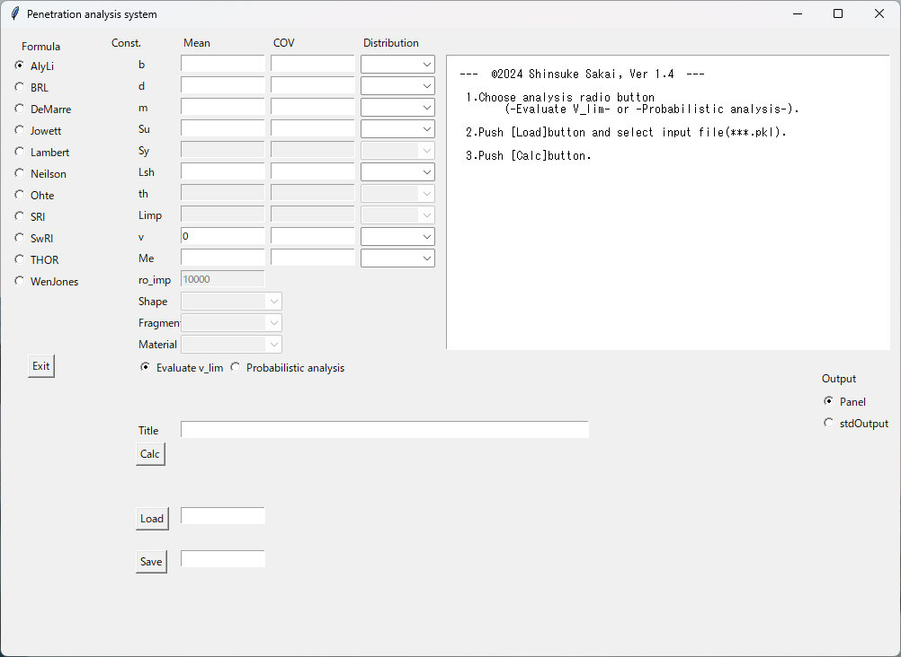
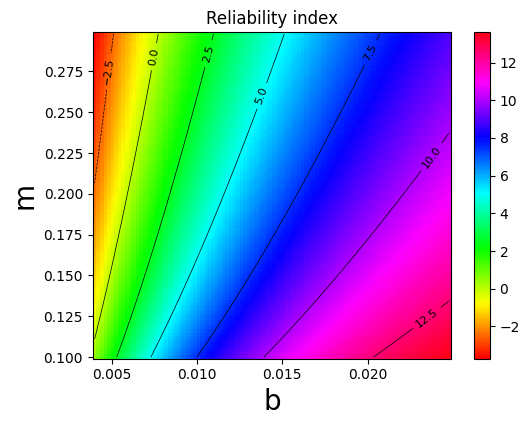

# Software code for
## APPLICATION OF LIMIT STATE FUNCTION METHOD TO STATISITCAL ANALYSIS OF BALLISTIC PENETRATION   
                                          Shinsuke SAKAI (Yokohama National University, Japan)   
###  Requirements
1. The procedures for using PYTHON language must be completed    
1. The procedures for using Jupyter must be completed   
1. Whenever a package is reported as missing, install it using the pip command in the terminal  

###  Procedure
1. Download all contents in this repository   
1. Move to the Downloads folder   
1. Execute the following program for BRL example in the Jupyter code window   
```python
import InterPenet as ip
bb=ip.Base()
bb.CalcPenet('BRL.pkl')
```
If the following is output, the system is operating correctly.   
```
**Validation of [ v_bl ] satisfied**
**Validation of [ Limp/d ] satisfied**
**Validation of [ b/d ] satisfied**
**Validation of [ Lsh/d ] satisfied**
**Validation of [ Su ] not satisfied**: ,Value= 490000000.0
*** Probabilistic analysis ***
[ BRL Formula ]
variable= ['b', 'd', 'm', 'v', 'Me']
beta= -0.5571767489022684
Alpha= [ 0.06413751  0.06413751 -0.0427838  -0.9006759   0.42275907]
Pf= 0.7112966629840962
*** Analysis of Balistic Limit Velocity ***
Vbl= 102.34312241793276
File= BRL.pkl
```
#### Contents
|File name | Contents |
|:---| :--- |
|InterPenet.py|Package for the penetration analysis|
|LimitState.py|Package for limit state function method|
|AlyLi.pkl|Example data for Aly and Li Formula|
|THOR.pkl|Example data for THOR Equations|
|BRL.pkl|Example data for BRL Formula|
|DeMarre.pkl|Example data for De Marre Formula|
|Jowett.pkl|Example data for Jowett Formula|
|Lambert.pkl|Example data for Lambert and Jonas Approximation|
|Neilson.pkl|Example data for Neilson Foumula|
|Ohte.pkl|Example data for Ohte et al. Formula|
|SRI.pkl|Example data for SRI Equation|
|SwRE.pkl|Example data for SwRE Equation|
|WenJones.pkl|Example data for Wen and Jones Equation|
Data stream format of example data are serialized by [pickle](https://docs.python.org/3/library/pickle.html) module. You can read the contents of input data as follows. This is an example for BRL.pkl.
```python
import pickle
fname='BRL.pkl'
with open(fname,'rb') as f:
    df = pickle.load(f)
df
```
To change the calculation conditions in the BRL.pkl file and execute the calculations, follow these steps:
1.  Read BRL.pkl as dictionary-type data.   
1.  Edit it using an editor.
1.  Save dictionary-type df  as a file in pickle format.
1.  Execute the analysis using the system.   

An example program is as follows.
```python
import pickle
fname='BRL_mod.pkl' #File name of modified dictionary-type data
with open(fname, mode='wb') as fo: #Save df  as a file in pickle format
  pickle.dump(df, fo)
import InterPenet as ip
bb=ip.Base()
bb.CalcPenet('BRL_mod.pkl')
```

###  Format of inputs
#### example for the BRL formula
Inputs are written as dictionary-type data. For each probabilistic variables, specify the mean, coefficient of variation (cov), and distribution type (dist). As for the distribution type, you can choose from normal distribution, lognormal distribution, Weibull distribution, or Gumbel distribution.For each probabilistic variables, specify the mean, coefficient of variation (cov), and distribution type (dist). As for the distribution type, you can choose from normal distribution, lognormal distribution, Weibull distribution, or Gumbel distribution.    
  Example inputs for BRL formula is shown below.
```
data={"b":{"mean":4/1000,"cov":0.01,"dist":"normal"}, 
"d":{"mean":0.02,"cov":0.01,"dist":"normal"},
"m":{"mean":0.197,"cov":0.01,"dist":"normal"},
 "v":{"mean":150,"cov":0.1,"dist":"normal"},
"Limp":{"mean":0.08}, "Lsh":{"mean":0.5},
"Su":{"mean":490e6*1.2},
"Me": {’mean’: 1.1, ’cov’: 0.05, ’dist’: ’normal’},
"Title": ’Example for BRL’,
"formula": ’BRL’}
```
BRL formula is shown below.   
$v_{bl}=\alpha_7 \cdot 10^4 \frac{(bd)^{0.75}}{\sqrt{m}},   \alpha_7=5.37$


#### Symbols
|Symbol | Contents |
|:---:| :--- |
|$d$| maximum diameter of impactor|
|$b$| thickness of a shield|
|$m$|initial mass of the impactor|
|$Su$|ultimate tensile strength of shield material|
|$Sy$|yield stress of shield material|
|$Lsh$|unsupported shield panel span|
|$Limp$|length of impactor|
|$v$|velocity of impactor|
|$th$|angle between a normal vector to a shield surface and the direction of impactor|
|$Me$|Model error|
|Title|title of analysis|
|formula|name of formula|

### Development process of the LSFM model
The development process of the LSFM model can be summarized as follows: First, an expression representing the limiting velocity is developed. When developing a new model, it will be done through experiments. It is also possible to conduct a literature review to investigate expressions of interest. As a result, an expression like BRL formula shown above can be obtained. From this equation, code is created to represent a Python class that evaluates $g$ and $dg/dx$, and it is described as the lowest layer class . With this, the program development is complete. To evaluate the penetration probability, statistical data of the inputs that appear in $g$ must be prepared. The statistical data should be investigated for the mean value, COV value, and probability distribution of the random variables, and described in dictionary-type data as shown above. By loading this data into the developed system, penetration probability evaluation and sensitivity analysis can be realized. Therefore, the procedure from model development to probabilistic analysis can be achieved extremely easily.   
An example of Class BRL is shown below.

```python
class BRL(penMed):
    def __init__(self):
        self.variable=['b','d','m','v','Me']
        self.const=['Limp','Lsh','Su']
        title='BRL Formula'
        val_range={
            'v_bl':[57,270],
            'Limp/d':[1.25,8],
            'b/d':[0.1,1.0],
            'Lsh/d':[8,35],
            'Su':[315,500]
        }
        super().SaveTitle(title)
        super().SaveRange(val_range)
        super().SaveVariable(self.variable)
        super().SaveConst(self.const)
    def Validation(self,data):#Checking for validation of inputs
        b=data['b']['mean']
        d=data['d']['mean']
        m=data['m']['mean']
        Limp=data['Limp']['mean']
        Lsh=data['Lsh']['mean']
        Su=data['Su']['mean']
        a7=5.37
        v_bl=a7*1e4*(b*d)**0.75/m**0.5
        if self.i_Valid:
            super().check('v_bl',v_bl)
            super().check('Limp/d',Limp/d)
            super().check('b/d',b/d)
            super().check('Lsh/d',Lsh/d)
            super().check('Su',Su)
        else:
            ii=0
            if super().check_c('v_bl',v_bl)!=True: ii+=1
            if super().check_c('Limp/d',Limp/d)!=True: ii+=1
            if super().check_c('b/d',b/d)!=True: ii+=1
            if super().check_c('Lsh/d',Lsh/d)!=True: ii+=1
            if super().check_c('Su',Su)!=True: ii+=1
            return ii
    def gcalc(self,X):# Definition of g
        b=X[0]
        d=X[1]
        m=X[2]
        v=X[3]
        Me=X[4]
        a7=5.37
        g=Me*a7*1e4*(b*d)**0.75/m**0.5-v
        return g
    def dGdXcalc(self,X):# Definition of dg/dx
        dGdX=[0]*len(X)
        b=X[0]
        d=X[1]
        m=X[2]
        v=X[3]
        Me=X[4]
        a7=5.37
        dGdX[0]= Me*7500.0*a7*(b*d)**0.75/(b*m**0.5)
        dGdX[1]= Me*7500.0*a7*(b*d)**0.75/(d*m**0.5)
        dGdX[2]= Me*(-5000.0)*a7*(b*d)**0.75/m**1.5
        dGdX[3] =-1
        dGdX[4] = 10000.0*a7*(b*d)**0.75/m**0.5
        return dGdX
```

###  GUI Implementation
The analysis can be executed with the assistance of a GUI using the following program.
```python
import InterPenet as ip
ip.InterPenet()
```
The following GUI window will be shown.

Inputs are loaded by pushing "Load" button and execution will be done by pushing "Calc" button. The results will be shown in text panel.   

### Windows software
Windows software interP.exe will be created by using pyinstaller. After installing pyinstaller the creation will be done by the following command.
```python
!pyinstaller interP.py --onefile --noconsole
```
Creation takes an enormous amount of time, and the size of interP.exe becomes extremely large. It is recommended to use a PYTHON program for the analysis instead of interP.exe. The details of pyinstaller is shown in the follwing site.   
[Pyinstaller Manual](https://pyinstaller.org/en/stable/)

### Example of drawing contour map

```python
import Penetration as pn
import matplotlib.pyplot as plt
import numpy as np
data={"b":{"mean":4/1000,"cov":0.01,"dist":"normal"},
     "d":{"mean":0.02,"cov":0.01,"dist":"normal"},
     "m":{"mean":0.197,"cov":0.01,"dist":"normal"},
     "v":{"mean":150,"cov":0.1,"dist":"normal"},
     "Limp":{"mean":0.08},
     "Lsh":{"mean":0.5},
     "Su":{"mean":490e6*1.2},     
      'Me': {'mean': 1.1, 'cov': 0.05, 'dist': 'normal'},
      'Title': 'Example for BRL',
      'formula': 'BRL'}
brl=pn.BRL()#Generation of instance

# Setting the range of variables and the number of division
cdata={'b':{'min':4/1000,'max':25/1000,'div':100},
      'm':{'min':0.1,'max':0.3,'div':100}}
key=list(cdata.keys())
B,M,Z=brl.MakeContour(data,cdata)

plt.pcolormesh(B, M, Z[1], cmap='hsv')
plt.title('Reliability index')
pp=plt.colorbar (orientation="vertical") # setting colorbar  
plt.xlabel(key[0], fontsize=20)
plt.ylabel(key[1], fontsize=20)
plt.subplots_adjust(left=0.2,bottom=0.2)
# drawing contour map
contour=plt.contour(B, M, Z[1], colors='k', linewidths=0.5)
# expressing numerical values on contour line
plt.clabel(contour, inline=True, fontsize=8)
```

You will get the following contour map of reliability index.
